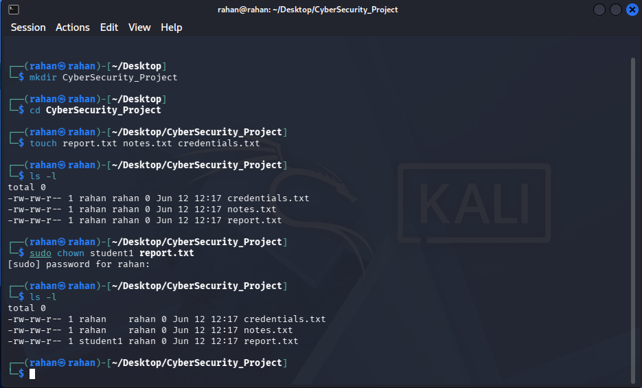
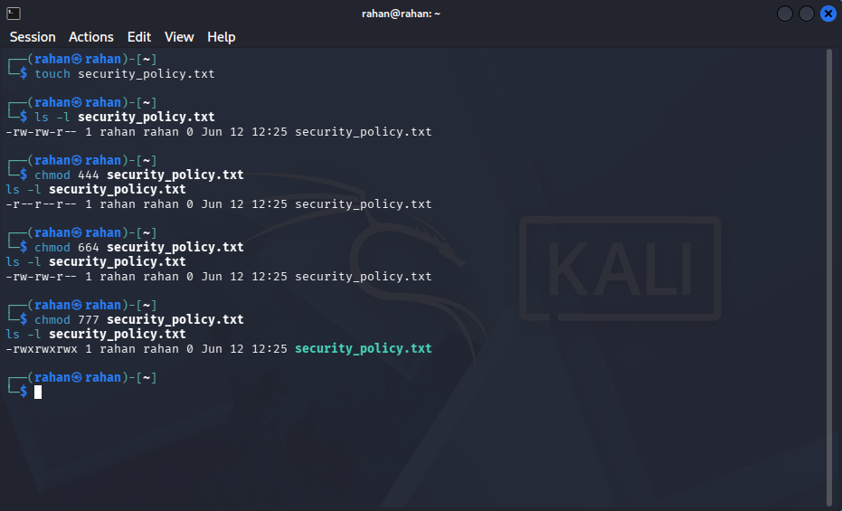

# Linux_Task_02_Rahan_Raj
This task introduces the fundamentals of Linux user management and file permission controls.

**Intern Name:** Rahan Raj K R                
**Date:** June 2026 

---

## 📋 Table of Contents
  
[Part A – Understanding Users](#part-a--understanding-users)  
[Part B – Creating Users & Groups](#part-b--creating-users--groups)  
[Part C – File Ownership](#part-c--file-ownership)  
[Part D – File Permissions](#part-d--file-permissions)  
[Part E – Permission Analysis](#part-e--permission-analysis)  
[Part F – Security Challenge](#part-f--security-challenge)  
[Part G – Security Research](#part-g--security-research) 
[Tools & Environment](#tools--environment)  
[What I Learned](#what-i-learned)


---

## Part A – Understanding Users

### Commands Used

```bash
whoami
id
cat /etc/passwd
```

### What I Found

| Command | Output | What It Means |
|---|---|---|
| `whoami` | `rahan` | Shows the currently logged-in user |
| `id` | `uid=1000 gid=1000 groups=1000` | Shows UID, GID, and group memberships |
| `cat /etc/passwd` | List of all users | Each line = one user account on the system |

### Understanding /etc/passwd

Each line in `/etc/passwd` follows this format:

```
username:x:UID:GID:comment:home_directory:shell
```

Example:
```
john:x:1000:1000:John Doe:/home/john:/bin/bash
```

- **UID** (User ID) — A unique number the system uses to identify each user
- **GID** (Group ID) — The primary group the user belongs to


---

## Part B – Creating Users & Groups

### Commands Used

```bash
# Create groups
sudo groupadd interns
sudo groupadd cyberteam

# Create users
sudo useradd student1
sudo useradd student2
sudo useradd student3

# Add users to groups
sudo usermod -aG interns student1
sudo usermod -aG interns student2
sudo usermod -aG cyberteam student3

# Verify
id student1 
id student2 
id student3

# OR
id student1 ; id student2 ; id student3
```

### Results

| User | Group Assigned |
|---|---|
| student1 | interns |
| student2 | interns |
| student3 | cyberteam |

> 

---

## Part C – File Ownership

### Commands Used

```bash
# Create project folder and files
mkdir CyberSecurity_Project
cd CyberSecurity_Project
touch report.txt notes.txt credentials.txt

# Check ownership
ls -l

# Change ownership
sudo chown student1 report.txt

# Verify the change
ls -l
```

### Ownership Before & After

| File | Original Owner | New Owner | Command Used |
|---|---|---|---|
| report.txt | rahan | student1 | `sudo chown student1 report.txt` |
| notes.txt | rahan | rahan | No change |
| credentials.txt | rahan | rahan | No change |

### Reading `ls -l` Output

```
total 0
-rw-rw-r-- 1 rahan    rahan 0 Jun 12 12:17 credentials.txt
-rw-rw-r-- 1 rahan    rahan 0 Jun 12 12:17 notes.txt
-rw-rw-r-- 1 student1 rahan 0 Jun 12 12:17 report.txt
```

| Part | Meaning |
|---|---|
| `-rw-r--r--` | File permissions (owner/group/others) |
| `1` | Number of hard links |
| `student1` | File owner |
| `rahan` | Group owner |
| `0` | File size in bytes |
| `Jun 12` | Last modified date |
| `report.txt` | File name |

> 

---

## Part D – File Permissions

### Commands Used

```bash
# Create the file
touch security_policy.txt

# Check current permissions
ls -l security_policy.txt

# Set Read Only (444)
chmod 444 security_policy.txt
ls -l security_policy.txt

# Set Read & Write (664)
chmod 664 security_policy.txt
ls -l security_policy.txt

# Set Full Access (777)
chmod 777 security_policy.txt
ls -l security_policy.txt
```

### Permission Changes Observed

| chmod Value | Symbolic Output | Meaning |
|---|---|---|
| `444` | `-r--r--r--` | Everyone can only read |
| `664` | `-rw-rw-r--` | Owner & group can read/write; others read only |
| `777` | `-rwxrwxrwx` | Everyone has full access |

### How chmod Numbers Work

Each digit represents **Owner / Group / Others** using this formula:

| Number | Permission | Symbol |
|---|---|---|
| 4 | Read | r |
| 2 | Write | w |
| 1 | Execute | x |
| 0 | No permission | - |

You add them up: `7 = 4+2+1 = rwx`, `6 = 4+2 = rw-`, `4 = r--`

>

---

## Part E – Permission Analysis

| Permission | Symbolic | Owner | Group | Others | Real-World Use Case |
|---|---|---|---|---|---|
| **755** | `rwxr-xr-x` | Full | Read+Execute | Read+Execute | Web server directories, scripts |
| **644** | `rw-r--r--` | Read+Write | Read only | Read only | Config files, HTML files |
| **777** | `rwxrwxrwx` | Full | Full | Full | Shared temp folders *(avoid in production!)* |
| **600** | `rw-------` | Read+Write | None | None | SSH private keys, password files |
| **700** | `rwx------` | Full | None | None | Private user scripts |

---

## Part F – Security Challenge

Recommended permissions for each sensitive file:

| File | Recommended Permission | Reason |
|---|---|---|
| `password_backup.txt` | **600** | Only the owner should ever access passwords |
| `public_notice.txt` | **644** | Owner can edit; everyone else reads only |
| `system_log.txt` | **640** | Owner (root) reads/writes; admin group can read; others blocked |
| `personal_notes.txt` | **600** | Strictly private — owner only, no group or other access |

---

## Part G – Security Research

### 1. Why are file permissions important in Linux?

File permissions control exactly who can **read**, **modify**, or **execute** a file. Without them, any user on the system could accidentally or intentionally delete important files, read private data, or run malicious code. Permissions are the first line of defense in securing a Linux system.

### 2. What happens if a sensitive file is given 777 permissions?

With `777`, every single user on the system — including attackers who have gained any user account — can read, edit, or delete the file. For example, if a password file has `777`, any logged-in user can open it and steal credentials. This is considered a critical security misconfiguration.

### 3. What is the Principle of Least Privilege?

The Principle of Least Privilege means giving each user **only the minimum permissions they need** to do their job — nothing more. For example, a web server only needs to read HTML files, not write to them. This limits the damage if an account gets compromised.

### 4. Why do organizations restrict user access to files and directories?

Organizations restrict access to:
- **Protect sensitive data** (passwords, customer info, financial records)
- **Prevent accidental damage** (a user can't delete files they can't write to)
- **Meet compliance requirements** (laws like GDPR require data to be protected)
- **Limit the impact of breaches** — if one account is hacked, the attacker only reaches what that account can access


---
## Tools & Environment


| Tool | Version |
|------|---------|
| Host OS | Windows 10 |
| VirtualBox | 7.2.8 |
| Kali Linux | 2026-05-05 |
| Terminal | Bash (default Kali shell) |

---

## What I Learned

Through this task, I gained hands-on experience with:

- How Linux tracks users using UIDs and GIDs stored in `/etc/passwd`
- How to create and manage users / groups using `useradd`, `groupadd`, and `usermod`
- How file ownership is assigned and changed using `chown`
- How to read and set file permissions using `chmod` and understand `ls -l` output
- Why the **Principle of Least Privilege** matters in real-world security
- How poor permissions (like `777`) can create serious vulnerabilities

---


*Submitted as part of the Cybersecurity Internship Program.*
*All commands were tested in a safe lab environment.*
